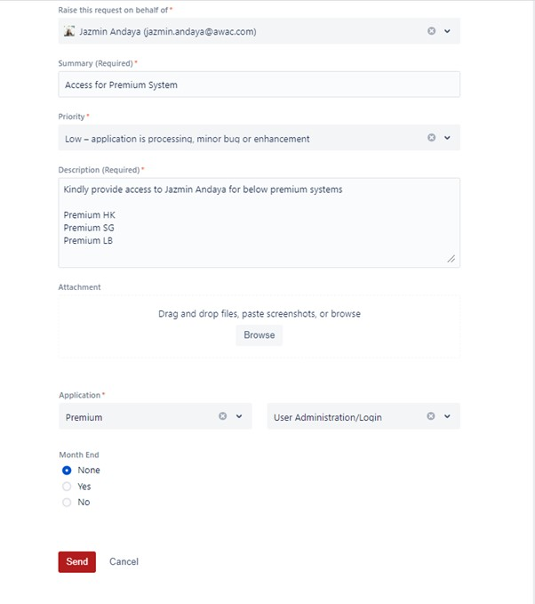
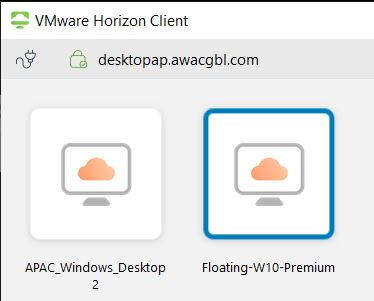
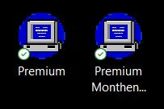
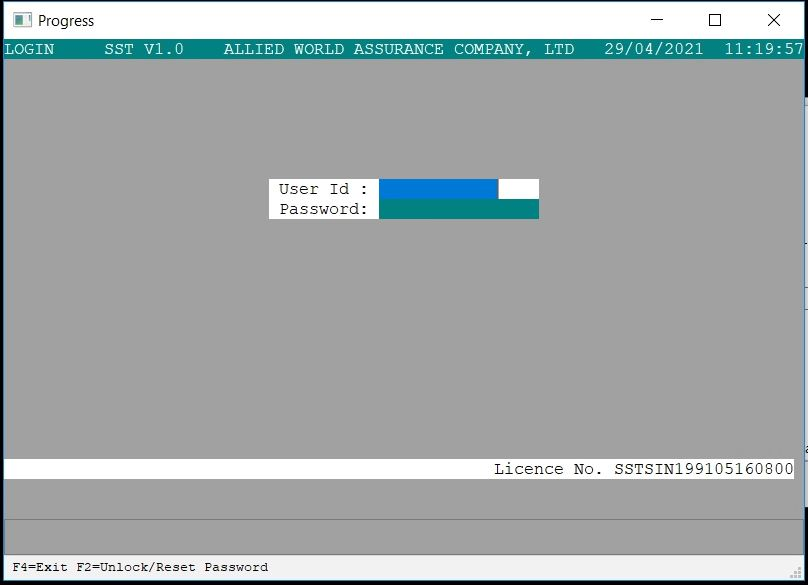
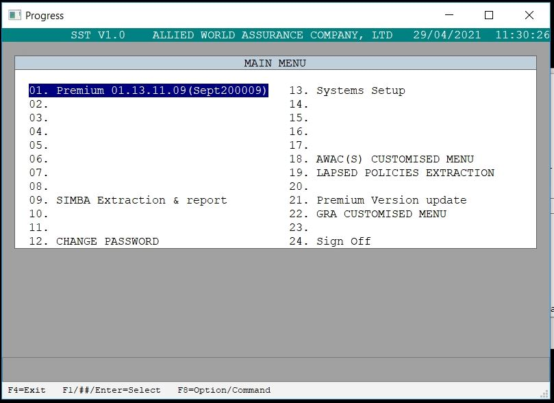
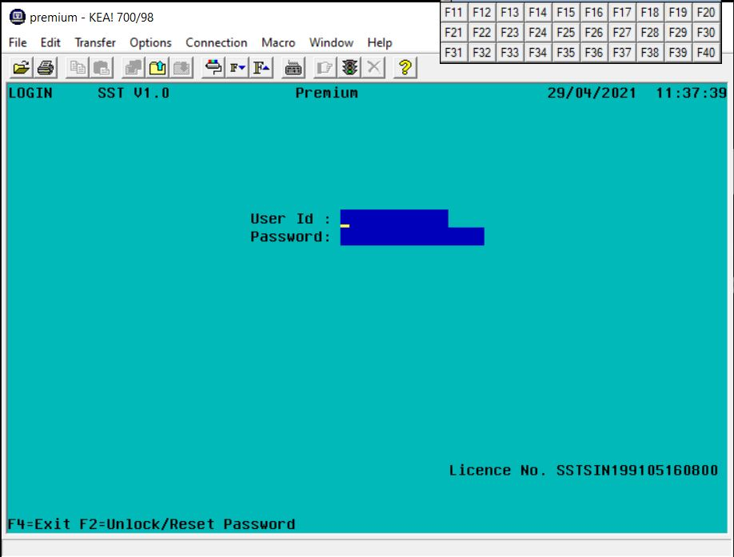

# Premium System Access - APAC

## Premium System Servers

Before you request for a Premium System Access, you must familiarize first on the different servers for Premium and its function. With this, you can understand and know what server you need access to. 

Below are the Premium System Servers for APAC

|Name | Environment | **DB Name** | Access Mechanism | Platform/OS | Description |
|-----|-------------|---------|------------------| ------------| ------------|
|Premium SG | Production | **SST1** | via VDI | Windows, Progress OpenEdge | Singapore Branch|
|Premium SG | Month-End | **SST6** | via VDI  | Windows, Progress OpenEdge | Month-End Reporting for SG|
|Premium SG | Test | **SST3** | via VDI | Windows, Progress OpenEdge | Dev/Test for SG | 
|Premium LB | Production | **SST7** | via VDI | Windows, Progress OpenEdge | Labuan, Malaysia Branch | 
|Premium LB | Month-End | **SST9** | via VDI |  Windows, Progress OpenEdge | Month-End Reporting for LB |
|Premium HK | Production | **SST1** | KEAH Telnet Client |  Linux, Progress Openedge | Hong-Kong Branch |
|Premium HK | Month-End | **SST1** | KEAH Telnet Client |  Linux, Progress Openedge | Month-End Reporting for HK
|Premium HK | Test | **SST1** | KEAH Telnet Client |  Linux, Progress Openedge | Dev/Test for HK|

 
 

## Requesting for Premium System Access

**IMPORTANT** 
*Most of the cases, the manager is the one to request for your access. If confirmed that you don't have an open ticket for the Premium System Access please proceed below, else you may skip this steps.*  
Always keep in mind the region and environment that you need an access for Premium system. Usually, SG, HK and LB are the typical access being provided for APAC. 

You can request a Premium System Access thru 
[Jira Service Desk](https://alliedworld.atlassian.net/servicedesk/customer/portals) and below are the steps and details needed. 

1. Request a ticket under "Support Center" 
1. Contact the Support Center by Submitting a Ticket 
1. Go under "Application" 
1. Fill-out the form with below details.    

## Premium System Tools

1. Premium Float  
    Premium Float is being used to access Premium System SG and LB. This can be access via VDI (VMware Horizon Client) 
         
    ** Premium Float Access is being provided together with your Premium Access Request. 
1. KEAHP Client 
    KEAHP Client is being use to access Premium system for HK. 
         
    ** If this tool is not available on your local machine or VDI, you may request a ticket for installation. 

## Validation Premium Access
When everything is already set-up and you have received your Premium System Access via e-mail, you may now validate this by doing below steps. 

### For SG and LB
1. Open VDI (VMware Horizon Client) 
1. Access *desktopap.awacgbl.com* and log-in using your windows account  
1. Click on *Floating-W10-Premium*
1. After accessing the server, you will see Premium application on the desktop with its designated DB Name. 
1. Double click the icon of the server you want to access and log-in thru the credentials provided.  

1. After logging-in, you will notice that some of the numbers on the screen are blank. This means that you are either don't have access or it is not set-up to your account.  
To navigate, you may use arrow keys and *enter* when selecting an option. To go back on the previous menu just click *F4*.  
**Be careful on with the update or write menus when you are on the production environment. 
### For HK 
1. Open your KEAHP Client and log-in thru the credentials provided.

1. Basically, all commands and options are the same as Premium SG and LB, the only difference is that you need to access the HK server thru KEAHP Client.  
** Make sure to update your password on your first log-in

